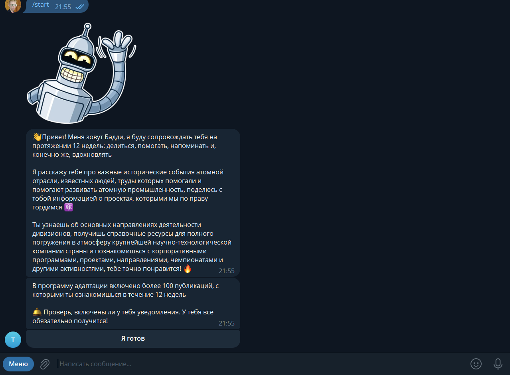
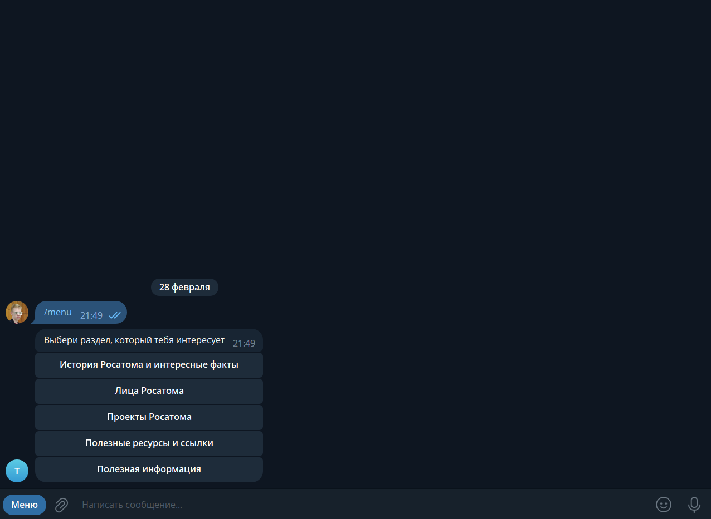
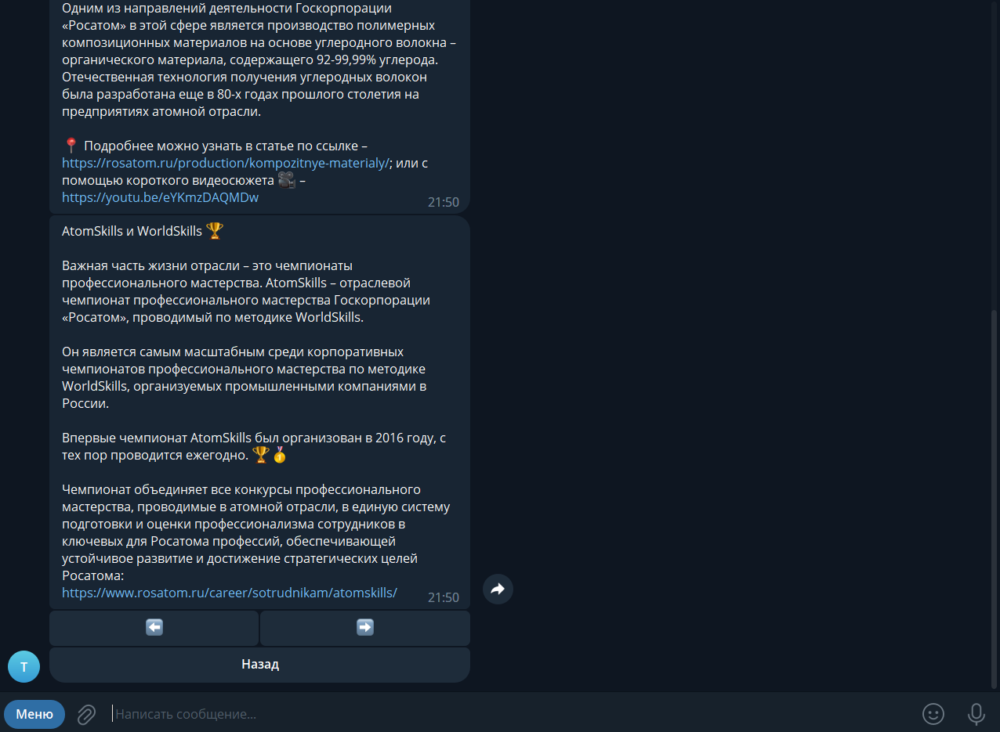

# Project description
Repository contains files of RosatomBuddy Telegram bot. 

This bot was created for Rosatom Corporation to adapt its new employees by sending different advices and very 
big amount of the facts and history about it according a schedule in the Google Sheets. All data is tracking and all 
detected changes will be added to PostgreSQL database. To use this bot user have to register and ensure 
company that he or she works in this company. All users can be displayed due to admin panel. 

This project uses Python libraries (version 3.8) such as:
+ aiogram
+ gspread
+ asyncio
+ asyncpg
+ etc

# Demonstration

